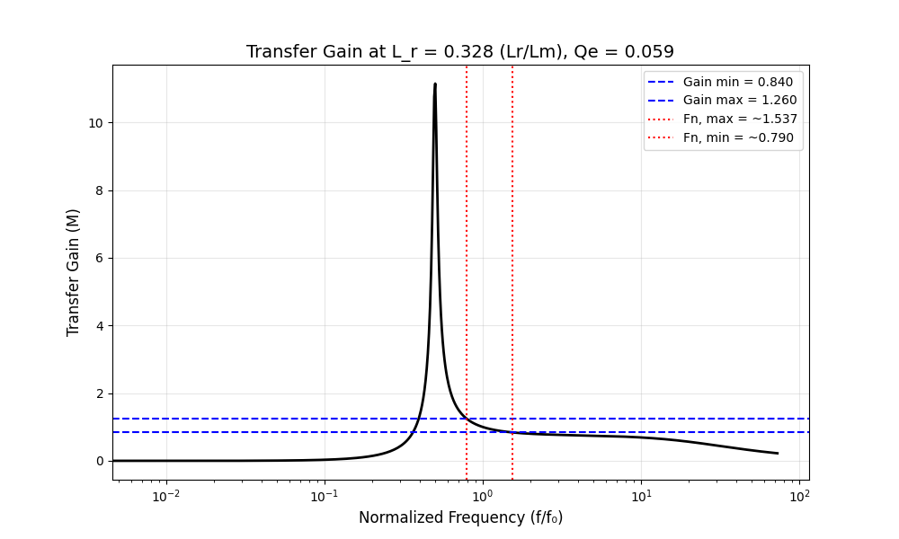
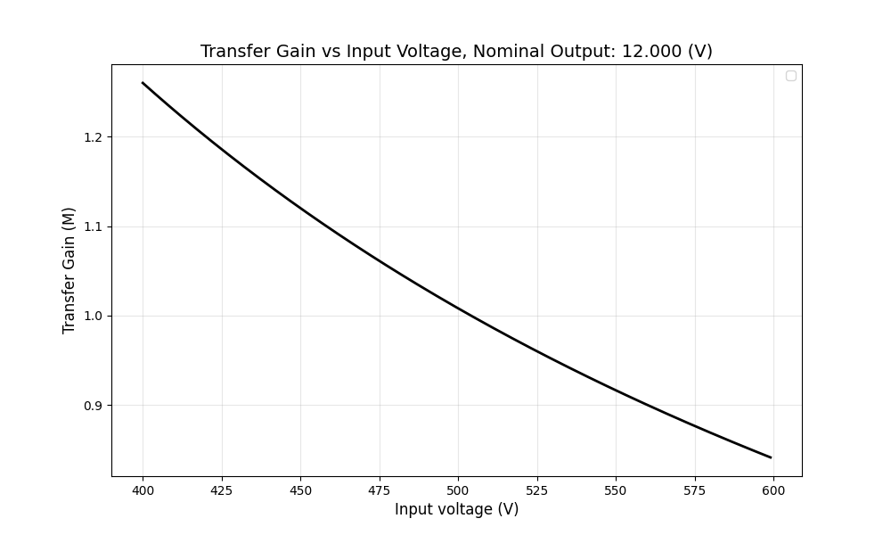
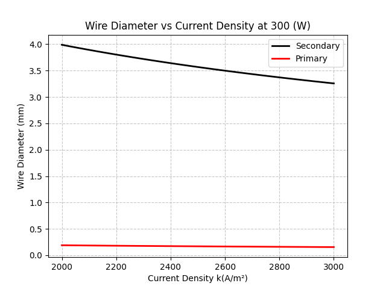

### Overview

This folder contains analytical models to explore design variables at medium fidelity but extremely fast.

### First Harmonic Approximation (FHA)

This analytical model is written in `Python` and uses `picounits` for parameter loading and unit validation. It models the resonant circuit two-port model described in application note `AN2450` by ST,
and also in a `2024 RMIT` paper, though they use different models. The ST FHA model was used in this implementation.

<em>Figure 1: First Harmonic Approximation output showing transfer gain (linear) vs frequency (log).</em>

> Model: [first_harmonic_approximation](first_harmonic_approximation/)  
> Parameters: [parameters.uiv](first_harmonic_approximation/parameters.uiv)

---

### Transfer Gain vs Input Voltage

This analytical model is written in `Python` and uses `picounits` for parameter loading and unit validation. It models the 
transfer gain vs input voltage using the equations described in application note `AN2450` by ST.

<em>Figure 2: Analytical model showing transfer gain (linear) vs input voltage (linear).</em>

> Model: [transfer_gain](transfer_gain/)  
> Parameters: [parameters.uiv](transfer_gain/parameters.uiv)

---

### Winding Loading

This analytical model is written in `Python` and uses `picounits` for parameter loading and unit validation. It calculates primary and secondary
wire diameters across a range of current densities at a target power level, helping to inform winding design for the LLC converter.

> [!IMPORTANT]
>
> Wire diameters shown are bulk equivalents. Litz wire or multi-strand conductors are required in practice due to skin.

<em>Figure 3: Primary and secondary wire diameter vs current density at a fixed target power.</em>

> Model: [winding_load](winding_load/)  
> Parameters: [parameters.uiv](winding_load/parameters.uiv)

---