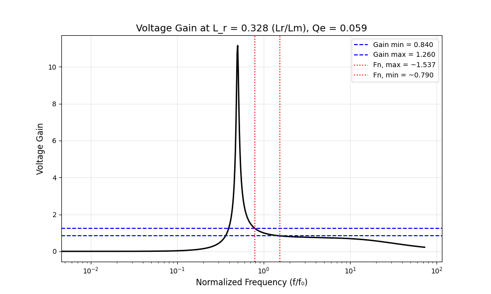

## Overview

This folder contains analytical models to explore design variables at medium fidelity but extremely fast.

### First Harmonic Approximation (FHA)

This analytical model is written in `Python` and uses `picounits` for parameter loading and unit validation. It models the resonant circuit two-port model described in application note `AN2450` by ST, and also in a `2024 RMIT` paper, though they use different models. The ST FHA model was used in this implementation.

<em>Figure 1: First Harmonic Approximation output showing voltage gain (linear) vs frequency (log) for the LLC resonant tank, plotted for varying quality factor (Qe) and inductance ratio (Ln) (Lr/Lm).</em>

> [!note]
> Model: [first_harmonic_approximation](first_harmonic_approximation/)  
> Parameters: [parameters.uiv](first_harmonic_approximation/parameters.uiv)

---