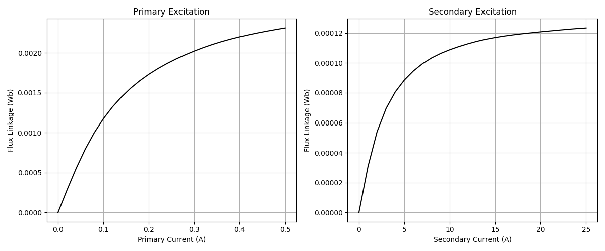

### 01_finite_element

This folder contains finite element models to explore design variables related to spatial fields.

---

#### Magnetostatic Transformer

*(Work in progress)*

<em>Figure 1: Flux linkage (linear) vs current (linear) for the primary and secondary windings.</em>

> Model: [transformer](./00_transformer/orchestrator.py)  
> Parameters: [parameters.uiv](./00_transformer/parameters.uiv)

---

#### Magnetostatic Inductor

*(Work in progress)*

> Model: [inductor](./01_inductor/orchestrator.py)  
> Parameters: [parameters.uiv](./01_inductor/parameters.uiv)

---