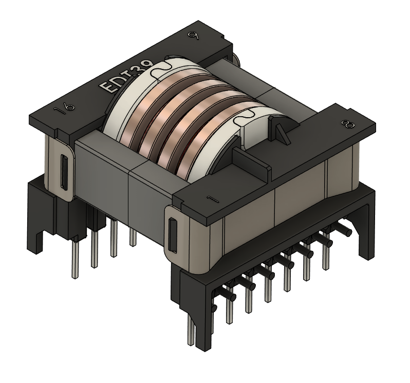
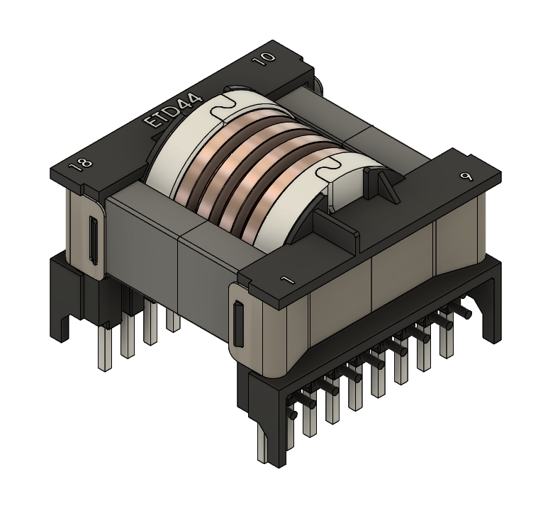

### 02_passives

This folder contains the designs for the resonant transformer and external inductor within the LLC converter.

---

#### [00_resonant_transformer](./00_resonant_transformer/readme.md) — Primary & Backup transformers

  <table>
    <tr>
      <td></td>
      <td></td>
    </tr>
    <tr>
      <td><em>Primary Transformer</em></td>
      <td><em>Backup Transformer</em></td>
    </tr>
  </table>

The resonant transformer makes up a part of the resonant tank circuit, serving as galvanic isolation and setting the step-down or step-up ratio of the system, with the driving frequency fine-tuning the system into resonance.

---

### [01_external_inductor](./01_external_inductor/readme.md) - External Inductor

The external inductor allows for tuning of the resonant tank circuit via its self-inductance.

---