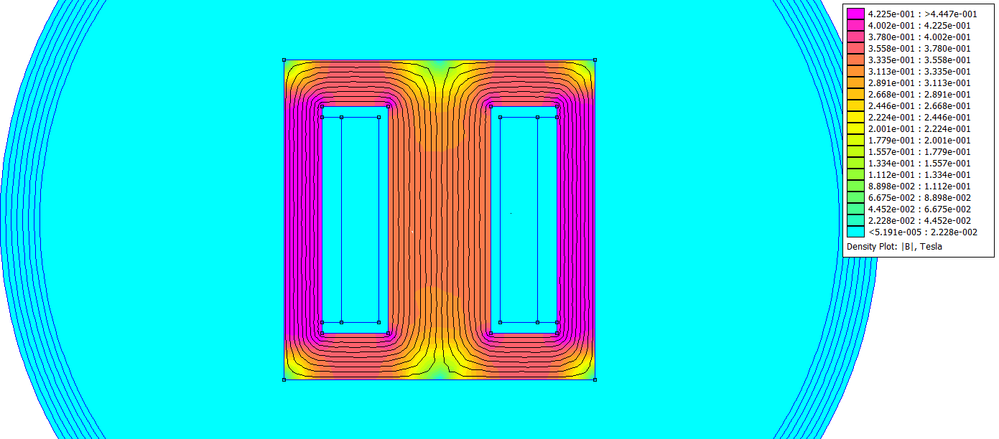

<!--
Colors:
FFFFFF - Pure white
e01e37 - Bold crimson-red 

Hello,
I think this is/was (for future tense) a very fun
project and I believe it's a good demonstration of my
engineering skills outside of me just making a linear
motor for example or some complex PCB at home. 

I enjoyed working with others for once, and being able
to have my own architecturally defined piece in the 
car is pretty damn cool.

- William Bowley, 2026-08-17

P.S: 
Thanks for downloading the APU repository `▽`ʃ♡ — but please be safe with high-voltage boards :)

-->

<p align="center">
  
  <br>
  <em>
    A proposed low-voltage grounded APU for FSAE-A vehicles 
    <br>
    Engineered by 
    <a href="https://github.com/wgbowley">William Bowley</a>
  </em>
</p>

### Overview


<!-- > This repository was done for the `FSAE` elective `(AUTO1931)` at RMIT between 20 July and 13 Nov, 2026. -->

The APU is a proposed low-voltage grounded (LVG) system that allows the tractive battery, while connected, to feed the LVG system via an
isolated LLC converter, effectively using the LVG battery as a line buffer. This has the secondary benefit of allowing standby mode 
while the tractive battery is disconnected.

```
Traction battery (600 V) → APU-LLC (12 V) → APU-Battery (12 V) → LVG Systems (12 V)
```

### Objectives

```
- Support a `600-400 V` input range from the tractive battery.
- Support up to `300 W` continuous loads on the APU and `800 W` peaks.
- Reach an asymptote temperature under `70°C` with passive cooling.
- Validate the APU architecture and generate performance curves.
- Pass the EMC/EMI requirements and pass the 2027 Formula SAE rules inspection.
```

> The project scoping document can be found within [00_docs](./00_docs/) or [directly](./00_docs/01_scope.pdf).

---

### Magnetic Passives

#### Transformer

> *(Work in progress). The resonant transformer is currently being designed and implemented.*

The transformer forms the magnetising inductance $L_m$ and sets the baseline voltage of the system. This specific implementation uses an `N87` core with a 
`glass fibre` coil former. The turns ratio is `21:1`, with litz wire used on both the primary and secondary due to the ~100–200 kHz operating frequency.

<div align="center">
  
  <br>
  <em>Planar approximation using FEMM of Transformer |B| field</em>
</div>

<br>

See the [simulation notes](./01_simulation/readme.md) for implementation details and other tooling.

#### Inductor

> *(Dependency). The resonant inductor is dependent on the implementation of the transformer.*

The inductor forms the series inductance $L_r$, which allows for frequency response tuning. For this specific implementation, this inductor 
enables less precise transformer design and manufacturing compared to combining $L_r$ into the transformer via leakage inductance.

---

### LLC-HVS & LLC-LVS Boards

> *(Dependency). The LLC-HVS and LLC-LVS are dependent on the implementation of the magnetic passives.*

#### Proposed Topology

```
LLC-HVS — Tractive Battery Input (400–600 V Domain) (Unknown EMI)
-----------------------------------------------------------------
EMI Filter (Common-mode chokes) (Shunt Capacitors)
         ↓
Half-Bridge MOSFETs ← Half-Bridge Driver IC ← LLC Controller → LLC-HVS Optocoupler
         ↓
Resonant Tank Circuit (Capacitor & Inductor)
-----------------------------------------------------------------
High-Frequency Transformer (Primary) (400-600 HF AC)

=============================================
Ferrite Core (Magnetic & Structural Coupling)
=============================================

LLC-LVS — High-Frequency Transformer (Secondary) (12 V AC)
-----------------------------------------------------------------
Synchronous Rectifier
        ↓
Status MCU (STM32) ← LLC-HVS Optocoupler 
-----------------------------------------------------------------
```

---

### APU Battery & External Charging Interface

> *(Dependency). The APU battery is dependent on the implementation of the LLC-HVS and LLC-LVS.*

#### Proposed Topology

```
APU-EBC (Isolated Supply) (Unknown Range) → APU-BI (interface) → APU-battery (12 V) (Undecided Capacity)
```

> EBC = External Battery Charger & BI = Battery Interface.

---

### APU Packaging & Integration

> *(Dependency). The APU packaging is dependent on all of the above systems.*

#### Proposed Integration

> [!NOTE]
> This is a very early conceptual integration. Boundaries are likely to evolve given the number of dependencies.

The proposed integration is to package the LLC converter above the APU battery, with the converter ultimately sitting next to 
the APU-BI and APU-EBC boards, with a separation plane between the battery. That plane splits the APU into two sections: 
the `electronics box` with EMI shielding and the `battery box` with appropriate containment systems.

---

### Documentation

All internal documentation (design notes) can be found within this repo's [issues](https://github.com/rmit-wgbowley/LV-Isolated-Buck/issues).

#### Tags
```
Project Progress:
----------------------------------------------------
LX -> Documentation and project structure
L0 -> Review and analysis of reference designs
L1 -> System level design, topology and interfaces
L2 -> Detailed design & prototyping
L3 -> Testing & Validation of prototype
----------------------------------------------------
```

<br>

```
Miscellaneous:
----------------------------------------------------
DS -> De-scoped Feature, De-scoped Analysis
AC -> Architectural Change
----------------------------------------------------
```

---


