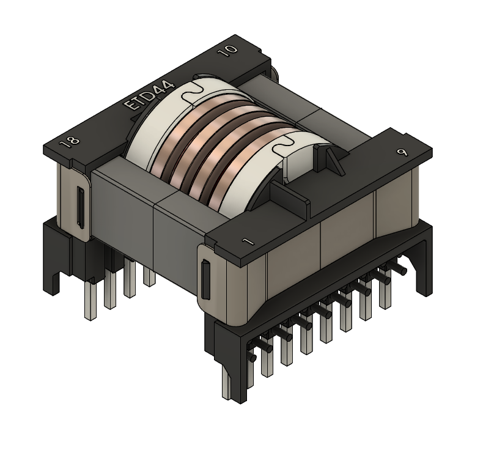
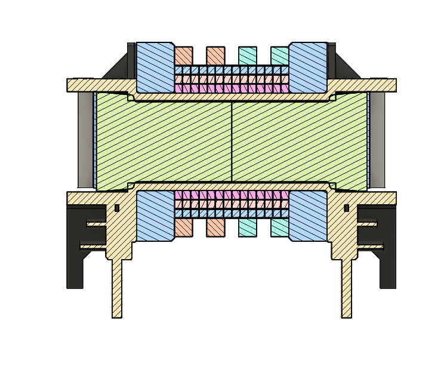
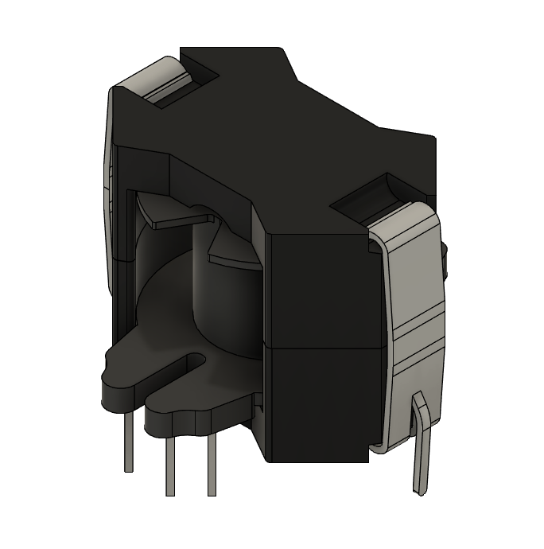
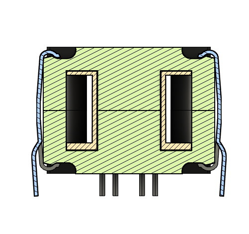

<!--
Colors:
FFFFFF - Pure white
e01e37 - Bold crimson-red 

Hello,
I enjoyed working with others for once, and being able
to have my own architecturally defined piece in the 
car is pretty damn cool.

- William Bowley, 2026-08-17

P.S: 
Thanks for downloading the APU repository `▽`ʃ♡ — but please be safe with high-voltage boards :)

-->


<div align="center">
  

  A proposed low-voltage grounded APU for FSAE-A vehicles <br>
</div>

### Overview

The APU is a proposed power architecture that allows the tractive battery, while connected, to feed the low-voltage grounded (LVG) system via an isolated LLC converter, using the LVG battery as a line buffer. 
The LVG battery also allows for standby mode while the tractive battery is disconnected.

```
Traction battery (600 V) → APU-LLC (12 V) → APU-Battery (12 V) → LVG Systems (12 V)
```

### Objectives

```
- [/] Support a `400-600 V` input range from the tractive battery.
- [/] Support up to `300 W (DC)` peak continuous loads on the APU and `800 W (DC)` peak transient loads.
- [ ] Reach an asymptote temperature under `70°C` with passive cooling.
- [ ] Validate the APU architecture and generate performance curves.
- [ ] Pass the EMC/EMI requirements and pass the 2027 Formula SAE rules inspection.
```

> *(Note). `[ ]` Not started. `[/]` In progress. `[x]` Complete.*

---

### Magnetic Passives

> *(Ordered). The transformer and inductor formers and cores are on-hand, with litz wire yet to be ordered.*

#### Transformer

The transformer used for this design has an `N87` core with a `glass fibre` coil former and snap-on `ABS` insulation rings. 
The turns ratio is `21:1:1`, with `0.125 mm × 64` litz wire used on the primary with a PTFE sleeve across 3 layers of 14 turns each. 
The secondary and tertiary windings each have a single layer of 2 turns with `0.125 mm × 650` litz wire. Each layer is wrapped in `0.1 mm`
polyimide tape.

<div align="center">
  <table>
    <tr>
      <td></td>
      <td></td>
    </tr>
  </table>
</div>

#### External Inductor

The external inductor used for this design has an `N87` core with a `glass fibre` coil former, and uses the same litz wire (`0.125 mm × 64`) as the transformer primary. The number of turns within the inductor is dependent on the transformer's characteristics.

<div align="center">
  <table>
    <tr>
      <td></td>
      <td></td>
    </tr>
  </table>
</div>


See the [`02_passives`](./02_passives/readme.md) for implementation details.

---

### LLC Boards

#### LLC High Voltage Side (LLC-HVS)

> *(Work in progress). This board is currently being designed in altium*

This board uses the `UCC25600DRG4` resonant mode controller to control the LLC half-bridge via the `ISO7720DWVR` for digital isolation. The half-bridge itself is built around the `IR2214SSPBF` with two `E3M0075120K` FETs. This board also contains the resonant network and the primary side of the transformer.

```
Resonant Controller (UCC25600DRG4)
              ↓
Digital Isolator (ISO7720DWVR)
              ↓
Half Bridge Driver (IR2214SSPBF) → FETs (E3M0075120K)
              ↓
Resonant Network (Series Capacitor, Inductor & Transformer Primary)
```

#### LLC Low Voltage Side (LLC-LVS)

> *(Dependency). This board is currently paused util LLC-HVS is finished.*

See the [`03_boards`](./03_boards/readme.md) for implementation details.

---

### APU Battery & External Charging Interface

> *(Dependency). The APU battery is dependent on the implementation of the LLC-HVS and LLC-LVS.*

The proposed battery type for the APU battery is a soft-case LiPo using 4 cells in series to achieve the required 12 V. 
LiPo batteries also tend to have a high C-rating, hence they can buffer high line transients.

---

### APU Packaging & Integration

> *(Dependency). The APU packaging is dependent on all of the above.* <br>

The proposed integration is to package the LLC converter above the APU battery, with the converter ultimately sitting next to the 
APU-BI and APU-EBC boards, with a separation plane between the battery.

---

### Documentation

Each section of the repo is self-documenting. <br>
For internal documentation, credits, and contributors, refer to [`00_docs`](./00_docs/readme.md).

---


